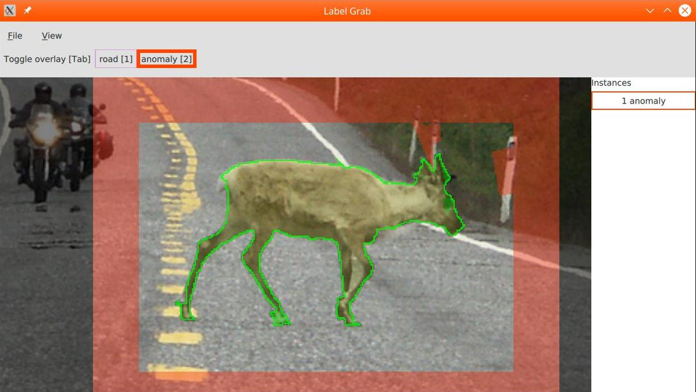

 
# Label Grab

Annotation tool for semantic and instance segmentation,
with automated help from the [GrabCut](https://cvg.ethz.ch/teaching/cvl/2012/grabcut-siggraph04.pdf) algorithm [implemented in OpenCV](https://docs.opencv.org/4.0.1/d8/d83/tutorial_py_grabcut.html).

The algorithm attempts to find the foreground object in a user-selected bounding box.
It presents a suggested per-pixel mask, the user can then correct its mistakes and next suggestion
will take those into account.



## Installation
Install the following python modules:
```
pip install numpy opencv-python imageio click qtpy pyside2 qimage2ndarray
```

It also needs Qt 5.11 or higher libraries on the system.
On Linux, these are in the repositories.

On Windows, they can be downloaded [here](https://www.qt.io/download-qt-installer). 
After installation, set the environemnt variables: 
* `QT_PLUGIN_PATH` to `Qt\5.12.1\msvc2017_64\plugins`
* `QML2_IMPORT_PATH` to `Qt\5.12.1\msvc2017_64\qml`

where `Qt` is the installation directory.

We plan to package all the necessary files with [pyinstaller](https://www.pyinstaller.org/).

#### Conflict with `conda` installation

If you have a `conda` python installation, it may happen that you have conda `qt` and `pyqt` packages installed (they get installed together with unrelated libraries like matplotlib).
These packages have an old Qt version and cause this program to crash.
There are several ways to solve this:

* Remove the packages from conda if you don't need them: `conda remove qt pyqt --force`

* Create a new conda environment and install the packages from pip using the command above.


## Usage

Run
```
python main.py --config my_config.json
```

The config file specifies the semantic classes, for example:
```json
{
	"classes": [
		{"id": 1, "name": "road", "color": "plum"},
		{"id": 2, "name": "anomaly", "color": "orangered"}
	]
}
```
If the `--config` option is not specified, the default config above will be used.

#### Files

* **Open** `[Ctrl + O]` the image to be labeled. If the image was annotated previously with this program, it will automatically load the state of the labeling.

* **Save** `[Ctrl + S]` the labels. They are saved to the location of the image file, in a directory ending with `.labels`. The output files:
	* `labels_semantic.png` - index of each pixel's semantic class
	* `labels_semantic_color.png` - color of each pixel's semantic class
	* `labels_instance.png` - the index of each pixel's instance.

#### View
* **Zoom** with scroll wheel.
* **Move** the image with the middle mouse button, or `Ctrl` + any mouse button.
* **Toggle the overlay** by pressing `Tab`

#### Instances

* **Create a new instance** by pressing `Shift` and drawing a bounding box around the object with the left mouse button.
The new instance will be initialized and you can now edit the instance's mask.

* **Editing the mask** of the selected instance.

	* Upon creation of an instance, GrabCut will make an initial suggestion of the foreground object's mask.
	You can correct this mask by marking areas which should be included or excluded from the object.
	GrabCut will update its suggestion based on your markings.

	* If there is a area that should be part of the mask, but is not, mark is as "sure object": *left*-click on points to draw a polygon and *double*-click to finish the polygon. Alternatively, `Alt` + click to mark a circle at cursor position. 	
	The "sure object" areas will be denoted by a green overlay. Cancel the polygon by pressing `Esc`

	* If there is a area that should be part of the mask, but is not, mark is as "sure background": *right*-click on points to draw a polygon *double*-click to finish the polygon. Alternatively, `Alt` + click to mark a circle at cursor position.
	The "sure background" areas will be denoted by a red overlay.

* **Choose the semantic class** of the currently selected instance using the buttons on the top bar (or corresponding keys `1`, `2`, ...)

* **Delete the selected instance** with `Delete`.

* **Select** which instance is selected from the instance list on right.

* **View all instances** by pressing `Esc`

------

The example image by Arno van den Tillaart under [CC-SA 2.0](https://creativecommons.org/licenses/by-sa/2.0/deed.en) license, obtained from [wikimedia commons](https://commons.wikimedia.org/wiki/File:E6_near_Kv%C3%A6nangen.jpg).